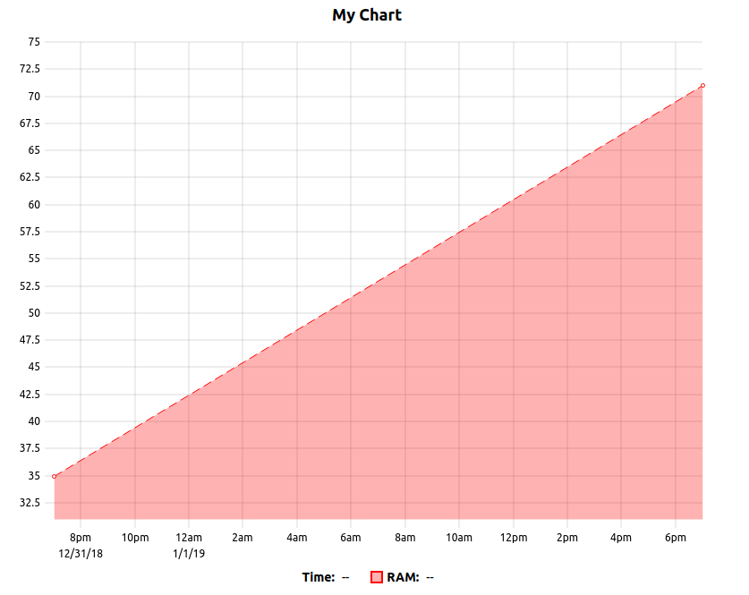

# soso.uplot_jupyter_widget

A feature-incomplete Jupyter widget for the incredible
[uPlot](https://github.com/leeoniya/uPlot) charting library.

## Status

This library is really new, don't expect too much but feel free to send pull
requests.

## Quickstart

`$ pip install git+https://github.com/sohailsomani/uplot_jupyter_widget`

You may also need to do the following:

```
$ jupyter nbextension install --py --symlink --sys-prefix jp_proxy_widget
$ jupyter nbextension enable --py --sys-prefix jp_proxy_widget
```

The following example is taken straight from the documentation. Note that if you
wish to evaluate any JS, prefix a string with `__js_eval:` as shown below.

```python
from soso.uplot_jupyter_widget import uPlotWidget

data = [
  [1546300800, 1546387200],    # x-values (timestamps)
  [        35,         71],    # y-values (series 1)
  [        90,         15],    # y-values (series 2)
]

opts = {
  'title': "My Chart",
  'id': "chart1",
  'class': "my-chart",
  'width': 800,
  'height': 600,
  'series': [
    {},
    {
      # initial toggled state (optional)
      'show': True,

      'spanGaps': False,

      # in-legend display
      'label': "RAM",
      'value': '__js_eval:(self, rawValue) => "$" + rawValue.toFixed(2)',

      # series style
      'stroke': "red",
      'width': 1,
      'fill': "rgba(255, 0, 0, 0.3)",
      'dash': [10, 5],
    }
  ],    
}

plot = uPlotWidget(
  data=data,
  opts=opts,
  js="https://raw.githubusercontent.com/leeoniya/uPlot/1.6.4/dist/uPlot.iife.min.js",
  css="https://raw.githubusercontent.com/leeoniya/uPlot/1.6.4/dist/uPlot.min.css"
)
display(plot)
```

Results in the following:



See [notebooks/notebook.ipynb](notebooks/notebook.ipynb).

## Main Features

* It supposedly works

## Motivation

It didn't exist

## Implementation

Use of the excellent
[jp_proxy_widget](https://github.com/AaronWatters/jp_proxy_widget) library.
